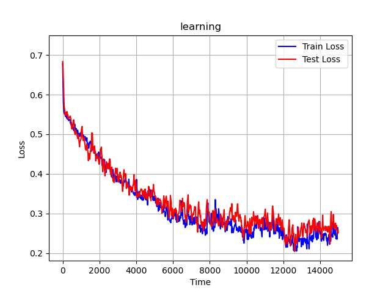
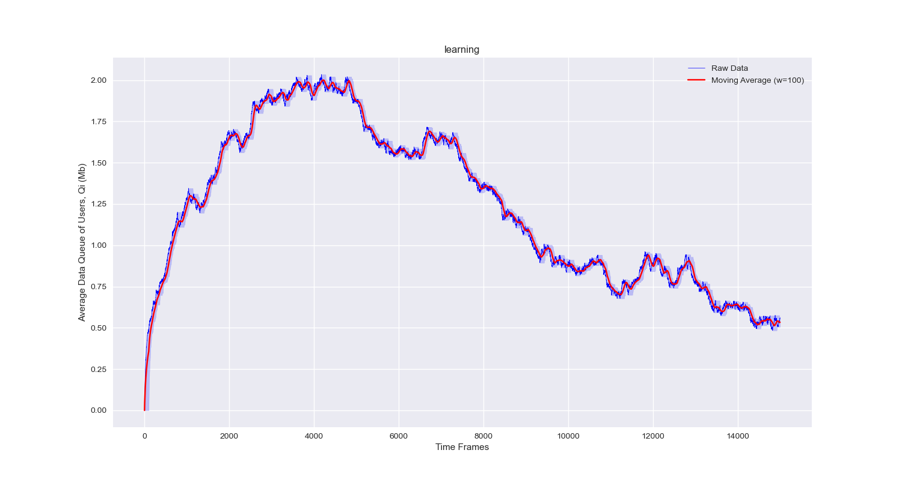

# Deep Reinforcement Learning for Computational Offloading in Mobile Edge Computing Networks 

This repository is the implementation of the deep reinforcement learning (DRL) framework proposed in the paper [__"Deep Reinforcement Learning-based Online Resource Management for UAV-Assisted Edge Computing with Dual Connectivity,"__](https://ieeexplore.ieee.org/document/10102429) in _IEEE/ACM Transactions on Networking (2023)_ [[Preprint](https://linhhoang-ex.github.io/files/TechRxiv-ToN-DualConnectivity.pdf)]. The framework is developed to balance computational workloads between a terrestrial base station (the Master eNodeB) and a drone base station (the Second eNodeB) for a dynamic edge computing system with dual connectivity. The framework is an actor-critic DRL structure, where the actor module is implemented using a Convulutional Neural Network (CNN), while the critic module is guided by the [Lyapunov optimization framework](https://en.wikipedia.org/wiki/Lyapunov_optimization).

### Repository structure 
- [system_paras.py](system_paras.py): define the simulation parameters, edit this file to set up the simulation
- [main.py](main.py): the main script, run this to start simulation 
- [memoryTF2conv.py](memoryTF2conv.py): implementation of the actor-critic framework of DRL  
- [server.py](server.py): class definition of the MEC server (UAV)
- [user.py](user.py): class definition of the user, use this script to generate user data   
- [arrival_task.py](arrival_task.py): implementation of the task arrival model, use this script to generate arrival traffic  
- [utils.py](utils.py): includes some utility functions for unit conversion, data export, and plotting 
- [in_tasks](in_tasks): consists of pickle files - simulation's input data regarding the arrival task
- [in_users](in_users): consists of pickle files - simulation's input data regarding the channel gains and locations of users
- [trained_models](trained_models): consists of *.json and *.h5 files, parameters of the neural network after training 
- [sim](sim): after simulation, figures and numerical results are exported here 
 

### How it works 
To run the simulation, please follows these steps:
1. Configure system parameters in the file [system_paras.py](system_paras.py) 
2. Run this file to start the simulation: [main.py](main.py)
3. Afrer simulation, figures and numerical results will be exported to the folder [sim](sim). 

The following figures illustrate an example output when simulating with arrival rate $\lambda=3$ Mbps (stress test for queue stability). Being initiated at zero, the user queue piles up rapidly in the early phase with the incoming computational tasks and limitation of local processing capability. During this process, the reinforcement learning agent makes decisions on user association (user-server mapping) and gradually learns from experience to improve the association policy. In the latter phase, thanks to the proper user association, the user can offload more tasks to the edge server over the same wireless channel, thus reducing their backlog queue.   
| Training Loss            |  User's Backlog Queue |
| :------------------------: | :------------------------: |
|  |  |


### Cite this work 
```
@ARTICLE{10102429,
  author={Hoang, Linh T. and Nguyen, Chuyen T. and Pham, Anh T.},
  journal={IEEE/ACM Transactions on Networking}, 
  title={Deep Reinforcement Learning-Based Online Resource Management for UAV-Assisted Edge Computing With Dual Connectivity}, 
  year={2023},
  volume={},
  number={},
  pages={1-16},
  doi={10.1109/TNET.2023.3263538}}
```

### About the authors 
- [Linh T. HOANG](https://linhhoang-ex.github.io/), d8232104 AT u-aizu.ac.jp
- [Chuyen T. NGUYEN](https://scholar.google.com/citations?user=2QOv90kAAAAJ&hl=en), chuyen.nguyenthanh AT hust.edu.vn
- [Anh T. PHAM](https://scholar.google.com/citations?user=u_36lx4AAAAJ&hl=en), pham AT u-aizu.ac.jp